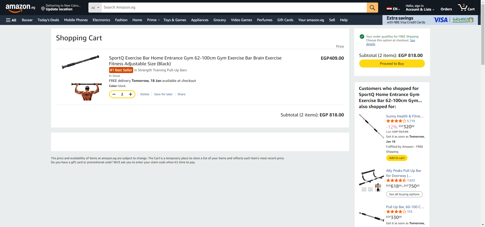

# Amazon Automation Tests

This project contains Selenium + TestNG automation tests for [Amazon.eg](https://www.amazon.eg/).  
It includes **3 main test scenarios** to verify login, cart functionality, and account menu access for guest users.  
Reports are generated with **ExtentReports**, and screenshots are captured automatically on failure.

---

## 📁 Project Structure

src/
└─ test/
└─ java/
├─ Pages/ # Page Object Model classes
│ ├─ login.java
│ ├─ homepage.java
│ ├─ cart.java
│ └─ accountMenu.java
├─ Tests/ # Test classes
│ ├─ loginTest.java
│ ├─ cartTest.java
│ └─ accountMenuTest.java
└─ utils/ # Utility classes
└─ └─utils.java

## ⚙️ Scenarios

### **Scenario 1: Login with unregistered email**
- Navigate to [Amazon.eg](https://www.amazon.eg/)
- Attempt login with a valid but unregistered email
- Verify user is redirected to the **signup page**
- Assertion is present to check correct navigation
- Screenshot captured on failure

---

### **Scenario 2: Add items to cart**
- Navigate to [Amazon.eg](https://www.amazon.eg/)
- Go to **Today’s Deals**
- Click on the **2nd category**
- Click on the **1st product**, then **2nd item**
- Add item to cart with **Qty = 2**
- Verify cart contains:
    - Correct item name
    - Correct price
    - Correct quantity
    - Correct subtotal
- Assertion is present for each verification
- Screenshot captured on failure

---

### **Scenario 3: Account menu access for guest**
- Hover over **"Hello, sign in Account & Lists"**
- Click **"Your Orders"** → Verify login is required
- Click **"Your Addresses"** → Verify login is required
- Click **"Your Lists"** → Verify intro screen is displayed
- Assertion is present for each verification
- Screenshot captured on failure

---

## 🏃 How to Run Tests

1. Make sure **Java JDK** and **Maven** are installed.
2. Open the project in **IntelliJ IDEA**.
3. Set the **path to ChromeDriver** if required.
4. Run tests by:
    - Right-clicking the **Tests folder** → Run all tests
    - Or run individual test classes:
        - `loginTest.java`
        - `cartTest.java`
        - `accountMenuTest.java`
5. Test results will be generated in **ExtentReport.html** in the project root.
6. Screenshots for failed tests will automatically be saved in the project and attached in the report.

---

## 📝 Notes
- Project uses **Page Object Model (POM)** for maintainability.
- **ExtentReports** used for reporting.
- **Utils.java** contains reusable methods like `takeScreenshot()`.
- Make sure browser window is maximized for hover actions to work correctly.
- Assertions ensure each step of the scenario is verified.
- This structure allows running each scenario independently, while reports capture all results.

---

## 📌 Screenshot Example in Report
When a test fails, a screenshot will be attached like this in the ExtentReport:

---

## 📚 Dependencies
- Selenium WebDriver
- TestNG
- ExtentReports